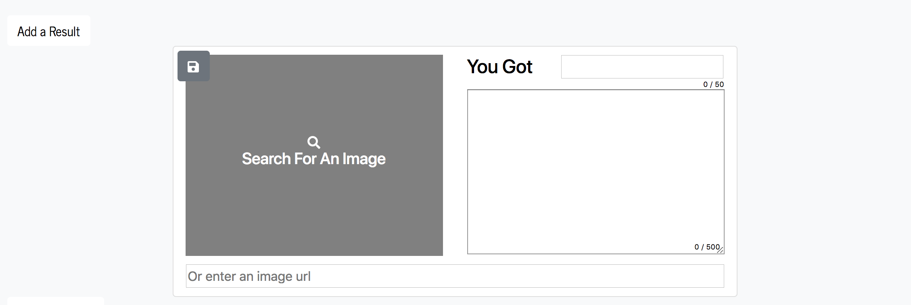
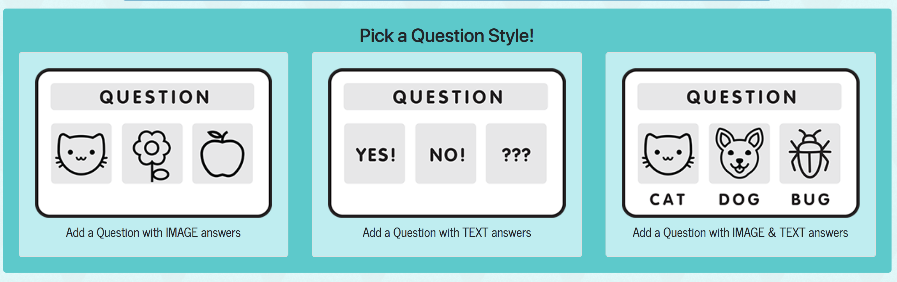

# A Buzzfeed-Style Quiz Maker
[](https://www.npmjs.com/)
[](https://www.mongodb.com/) 
[](https://github.com/jvallexm/quizfeed/blob/readme/LICENSE)

This application creates a BuzzFeed-style site where users can search for quizzes (by quiz name or user name) and they can create quizzes of their own. Question, answer and result options will be randomized images, words or a combination of both. We believe this is valuable for a couple of reasons. First, quizzes are fun! Second, the use of quizzes as a marketing tool can be very effective because they tend to drive tons of traffic to a site and they are a great way to collect email addresses. Email marketing continues to be one of the top ways businesses drive sales, so this would be a great lead generation tool. Quizzes are fun to create and easy to share!


## Table of Contents  
[Getting Started](#gettingStarted)  
[Creating A Quiz](#creatingAQuiz)  
[Built With](#builtWith)  
[Authors](#authors)  
[License](#license)


<a name="gettingStarted"/>

## Getting Started
To get the application up and running follow these simple steps:

   1. Clone the repository onto your computer.
   ```
   git clone git@github.com:jvallexm/quizfeed.git
   ```
   2. Install npm packages into the root folder and into the client folder of your application. In the command line, cd to the root folder then follow these commands: 
   ```
   npm install
   cd client
   npm install
   ```
   3. Obtain your own [Shutterstock](https://developers.shutterstock.com/) Client ID and Client Secret. Add these to your .env file.

   4. Finally, implement [MongoDB](https://www.mongodb.com/) and add your mlab variables to your .env as well. 

   5. `npm start` in the command line will run the app on your local server!

<a name="creatingAQuiz"/>

## Creating A Quiz
1. Choose a title for your quiz, a background color and text color.

    

2. Next, you'll need to work backwards by adding the final results of the quiz, ie 'You Got...' Search for images or add an image URL, and then give the result a title and description.

    

3. Choose the format of your questions...images only, text only, or a combination of images and text.

    

4. Write your questions and answers, then rank each answer to a corresponding result.

        

5. Publish your quiz!

        

     


<a name="builtWith"/>

## Built With
 - [Axios](https://www.npmjs.com/package/axios) - Handles HTTP requests
 - [Body-Parser](https://www.npmjs.com/package/body-parser) - Middleware to parse request bodies
 - [Bootstrap](https://getbootstrap.com/) - Front end framework
 - [Express](https://expressjs.com/) - Node.js web application framework
 - [Mocha](https://mochajs.org/) - Test framework
 - [Mongoose](http://mongoosejs.com/) - Object modeling for node.js
 - [Shutterstock](https://developers.shutterstock.com/) - Image search tool
 - [Create React App](https://github.com/facebookincubator/create-react-app) - Used for building the React framework
 - [React](https://github.com/facebook/react) - Javascript library for building user interfaces
 


<a name="authors"/>

## Authors
* [Jennifer Valle](https://github.com/jvallexm) (http://jennifer-valle.com)
* [Peter Johnstone](https://github.com/p2bilt) (http://p2bilt.com)
* [Amy Lumpkin](https://github.com/amylumpkin)
* [Melissa Capps](https://github.com/melissable)

<a name="license"/>

## License
This project is licensed under the MIT License - see the [LICENSE.md](https://github.com/jvallexm/quizfeed/blob/readme/LICENSE) file for details.


