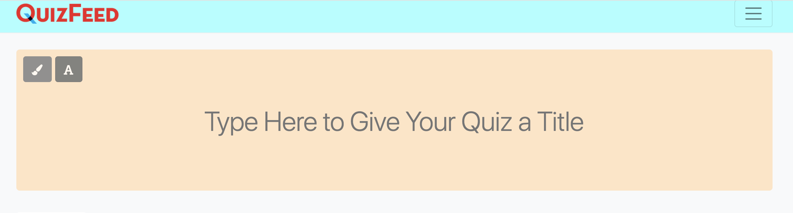
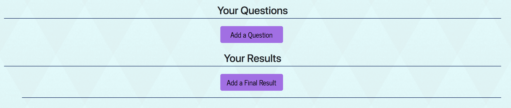
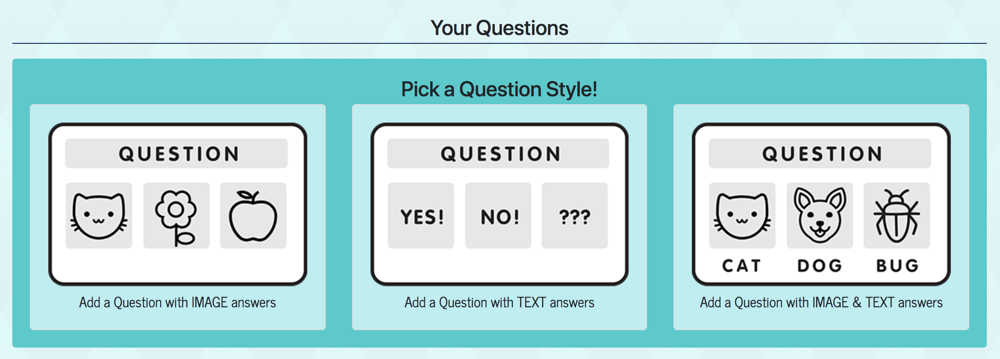
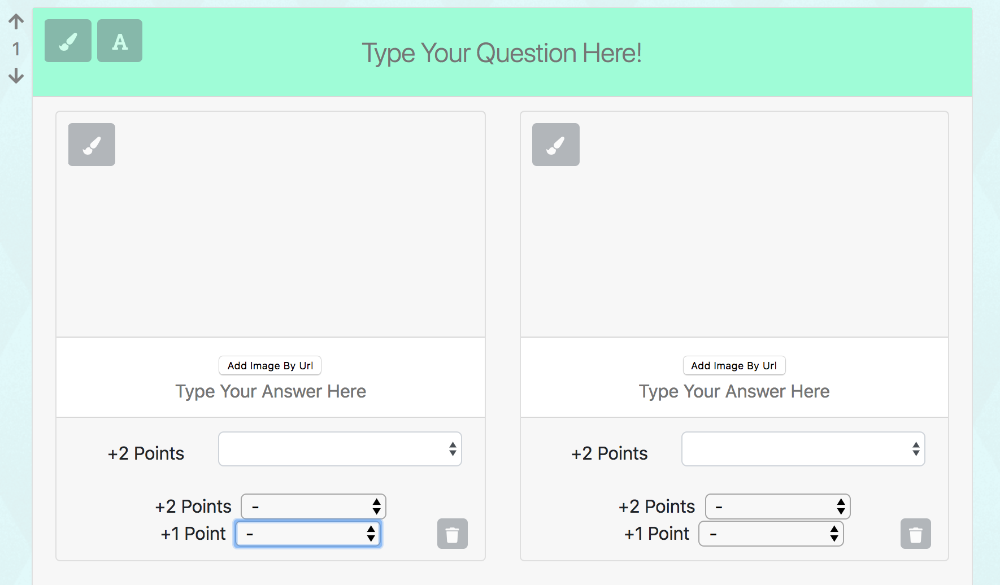
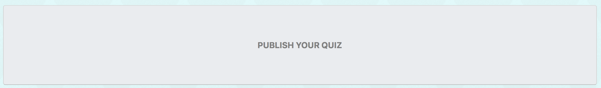

# A Buzzfeed-Style Quiz Maker
[](https://www.npmjs.com/)
[](https://www.mongodb.com/) 
[](https://github.com/jvallexm/quizfeed/blob/readme/LICENSE)
[](https://reactjs.org/docs/hello-world.html) 

This application is a BuzzFeed-style quiz making site. Users can search for quizzes (by quiz name or user name), they can create quizzes of their own and they can easily share them in a variety of ways. The question, answer and result options feature randomized images, words or a combination of both. We believe this app is valuable for a couple of reasons. First, quizzes are fun! Second, as a marketing tool, the use of a click-heavy activity can be a very effective way of generating heavy traffic to your site and offers the potential for capturing user information for lead generation. QuizFeed quizzes are fun to make and easy to share!


## Table of Contents  
[Getting Started](#gettingStarted)  
[Creating A Quiz](#creatingAQuiz)  
[Notes & Tips](#notesAndTips)  
[Built With](#builtWith)  
[Authors](#authors)  
[License](#license)


<a name="gettingStarted"/>

## Getting Started
To get the application up and running, follow these simple steps:

   1. Clone the repository onto your computer.
   ```
   git clone git@github.com:jvallexm/quizfeed.git
   ```
   2. Install npm packages into the root folder and into the client folder of your application. In the command line, cd to the root folder then follow these commands: 
   ```
   npm install
   cd client
   npm install
   ```
   3. Obtain your own [Shutterstock](https://developers.shutterstock.com/) Client ID and Client Secret. Add these to your .env file.

   4. Finally, implement [MongoDB](https://www.mongodb.com/) and add your mlab variables to your .env as well. 

   5. `npm start` in the command line will run the app on your local server!

<a name="creatingAQuiz"/>

## Creating A Quiz
1. After you've logged in, choose a title for your quiz (along with background and text colors), select a main image and also write a brief summary. 

    

2. Next, you will have two options...write your questions, or your results. You may want to work backwards by adding the final results of the quiz first which we'll explain later. 

    

3. Search for results images or add an image URL, and then give the result a title and description.   

    

4. Choose the format of your questions: images only, text only, or a combination of images and text.

    

5. Write your questions and answers, and assign each answer a result value (+1 or +2). This is why it's helpful to begin with the results option. Assign the result that most strongly correlates to the answer by assigning it +2 points. You can select a second result that is less strongly correlated by assigning +1 point, or you can leave the second point selection empty. All points are added together at the end to reveal the strongest result for the user!

        

6. Last, but not least, publish your quiz!

       

<a name="notesAndTips"/>    

## Notes & Tips      

- Once you've created a title and at least one question, your quiz will automatically save every 30 seconds!
- Your published quizzes and saved drafts will all appear in the drop down menu by your profile under 'My Quizzes'.  
- Once you've completed a quiz:
    - You can save any that you love by clicking 'Give This Quiz a :star:' to add to your favorites! 
    - You can then share any quiz by choosing your preferred method!

        

<a name="builtWith"/>

## Built With
 - [Axios](https://www.npmjs.com/package/axios) - Handles HTTP requests
 - [Body-Parser](https://www.npmjs.com/package/body-parser) - Middleware to parse request bodies
 - [Bootstrap](https://getbootstrap.com/) - Front end framework
 - [Express](https://expressjs.com/) - Node.js web application framework
 - [Mocha](https://mochajs.org/) - Test framework
 - [Mongoose](http://mongoosejs.com/) - Object modeling for node.js
 - [Shutterstock](https://developers.shutterstock.com/) - Image search tool
 - [Create React App](https://github.com/facebookincubator/create-react-app) - Used for building the React framework
 - [React](https://github.com/facebook/react) - Javascript library for building user interfaces
 


<a name="authors"/>

## Authors
* [Jennifer Valle](https://github.com/jvallexm) (http://jennifer-valle.com)
* [Peter Johnstone](https://github.com/p2bilt) (http://p2bilt.com)
* [Amy Lumpkin](https://github.com/amylumpkin)
* [Melissa Capps](https://github.com/melissable)

<a name="license"/>

## License
This project is licensed under the MIT License - see the [LICENSE](https://github.com/jvallexm/quizfeed/blob/readme/LICENSE) file for details.


